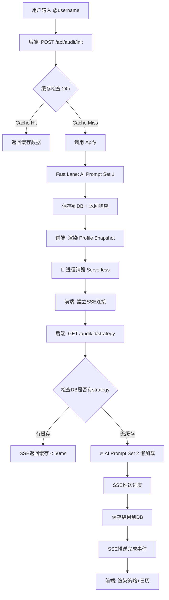

# Instagram 账号诊断工具 - 技术实现与开发计划文档

> **版本**: v1.0
> **日期**: 2025-01-28
> **架构原则**: 双速响应 (Two-Speed Architecture) + 成本优化 + 优雅降级

---

## 📋 目录

1. [项目概述](#1-项目概述)
2. [核心架构设计](#2-核心架构设计)
3. [数据流规范](#3-数据流规范)
4. [API接口文档](#4-api接口文档)
5. [数据库Schema设计](#5-数据库schema设计)
6. [前端组件结构](#6-前端组件结构)
7. [Apify调用逻辑](#7-apify调用逻辑)
8. [AI提示词设计](#8-ai提示词设计)
9. [缓存策略](#9-缓存策略)
10. [错误处理与降级](#10-错误处理与降级)
11. [开发排期](#11-开发排期)

---

## 1. 项目概述

### 1.1 业务目标
为 Instagram 本地商家提供一个**免费的账号诊断与内容策划工具**,作为 SaaS 产品的转化入口。

### 1.2 核心价值主张
- **Fast Lane (毫秒级)**: Profile Snapshot + 基础数据 (无需等待LLM)
- **Slow Lane (异步)**: AI策略分析 + 30天日历 + 图片生成
- **转化设计**: Day 1免费,Day 2-30 付费解锁

### 1.3 技术栈
- **前端**: Next.js 16 + React 19 + TypeScript + Tailwind CSS
- **后端**: Next.js API Routes + Prisma/Supabase
- **AI**: DeerAPI (Gemini) + 双提示词架构
- **爬虫**: Apify Instagram Scraper
- **生图**: Sidewalk AI (预留接口)
- **实时通信**: Server-Sent Events (SSE) 或 WebSocket

---

## 2. 核心架构设计

### 2.1 双速响应架构 (Two-Speed Architecture) - Serverless优化版



**🚨 关键修正**:
1. Fast Lane **不触发**后台任务 (避免进程冻结)
2. Slow Lane改为**懒加载** (SSE连接时才执行AI)
3. SSE长连接保持进程存活 (适配Serverless)

### 2.2 分层架构

| 层级 | 职责 | 响应时间 | 技术实现 |
|-----|------|---------|---------|
| **Presentation Layer** | 前端UI渲染 | < 100ms | React Server Components |
| **Fast API Layer** | 数据解析+缓存 | < 500ms | Next.js Route Handler |
| **Slow AI Layer** | LLM策略生成 | 10-30s | 后台异步任务 + SSE |
| **Data Layer** | 数据持久化 | < 50ms | Supabase (PostgreSQL) |
| **External Layer** | Apify + 生图 | 3-10s | Rate Limit + 重试机制 |

---

## 3. 数据流规范

### 3.1 Fast Lane 数据流

```typescript
// 1. Apify 原始数据 (apify_raw_data)
interface ApifyRawData {
  username: string
  fullName: string
  biography: string
  profilePicUrl: string
  followersCount: number
  followingCount: number
  postsCount: number
  verified: boolean
  businessCategoryName?: string
  externalUrl?: string
  latestPosts: Array<{
    id: string
    type: 'Image' | 'Video' | 'Sidecar' | 'Reel'
    caption: string
    displayUrl: string
    likesCount: number
    commentsCount: number
    timestamp: string
    hashtags: string[]
    locationName?: string
  }>
}

// 2. Fast Lane 解析结果 (profile_snapshot)
interface ProfileSnapshot {
  profile_snapshot: {
    handle: string                    // @username
    full_name: string
    avatar_url: string
    is_verified: boolean
    followers_display: string         // "1.2K" 或 "500"
    activity_status: 'Active' | 'Dormant' | 'Inactive'
    last_post_date: string           // YYYY-MM-DD
    avg_likes: number
    category_label: string           // "Coffee Shop"
    missing_elements: string[]       // ["Website", "Location"]
  }
  diagnosis_card: {
    score: number                     // 0-100
    summary_title: string
    key_issues: string[]              // 最多3个
  }
}
```

### 3.2 Slow Lane 数据流

```typescript
// 3. AI 策略生成结果 (strategy_blueprint)
interface StrategyBlueprint {
  strategy_section: {
    brand_persona: {
      archetype: string               // "The Friendly Neighbor"
      one_liner_bio: string           // 优化后的Bio
      tone_voice: string
    }
    target_audience: Array<{
      type: 'Main' | 'Secondary'
      description: string
      pain_point: string
    }>
    content_mix_chart: Array<{
      label: string
      percentage: number
    }>
  }
  execution_calendar: {
    day_1_detail: {
      title: string
      caption: string
      hashtags: string[]
      image_gen_prompt: string        // 传给 Sidewalk AI
    }
    month_plan: Array<{
      day: number                     // 2-30
      theme: string
      idea: string
    }>
  }
}
```

---

## 4. API接口文档

### 4.1 Fast API: 初始化诊断

```yaml
POST /api/audit/init
Content-Type: application/json

Request:
{
  "username": "zongzi_coffee",
  "skip_cache": false              # 可选,强制刷新
}

Response (200 OK):
{
  "audit_id": "uuid-xxx",
  "status": "snapshot_ready",      # snapshot_ready | analyzing | completed
  "profile_snapshot": { ... },     # ProfileSnapshot 结构
  "diagnosis_card": { ... },
  "created_at": "2025-01-28T10:00:00Z",
  "cache_hit": true,
  "expires_at": "2025-01-29T10:00:00Z"
}

Response (404 Not Found):
{
  "error": "PROFILE_NOT_FOUND",
  "message": "This account doesn't exist or is private",
  "ui_message": "抱歉,该账号不存在或已设为私密"
}

Response (429 Too Many Requests):
{
  "error": "RATE_LIMIT_EXCEEDED",
  "retry_after": 60,
  "message": "Please wait 60 seconds before retrying"
}
```

### 4.2 Slow API: 获取策略 (SSE)

```yaml
GET /api/audit/{audit_id}/strategy
Accept: text/event-stream

SSE Events:

event: status
data: {"phase": "analyzing", "progress": 10}

event: status
data: {"phase": "generating_persona", "progress": 30}

event: status
data: {"phase": "building_calendar", "progress": 60}

event: complete
data: {
  "strategy_section": { ... },
  "execution_calendar": { ... },
  "generated_at": "2025-01-28T10:00:30Z"
}

event: error
data: {
  "error": "AI_TIMEOUT",
  "fallback_available": true
}
```

### 4.3 轮询备用方案 (如果SSE不可用)

```yaml
GET /api/audit/{audit_id}/status

Response:
{
  "audit_id": "uuid-xxx",
  "status": "analyzing" | "completed" | "failed",
  "progress": 45,                    # 0-100
  "result": { ... }                  # 仅当 status=completed
}
```

### 4.4 图片生成 (预留)

```yaml
POST /api/audit/{audit_id}/generate-image
Content-Type: application/json

Request:
{
  "prompt": "A cozy coffee shop interior...",
  "style": "warm_professional",
  "logo_overlay": true
}

Response:
{
  "image_url": "https://cdn.sidewalk.ai/xxx.png",
  "thumbnail_url": "https://cdn.sidewalk.ai/xxx_thumb.png",
  "status": "completed" | "processing"
}
```

---

## 5. 数据库Schema设计

### 5.1 Supabase Schema (PostgreSQL)

```sql
-- ============================================
-- Table: audits (审计记录主表)
-- ============================================
CREATE TABLE audits (
  id UUID PRIMARY KEY DEFAULT uuid_generate_v4(),

  -- 基础信息
  username VARCHAR(255) NOT NULL,
  created_at TIMESTAMPTZ DEFAULT NOW(),
  updated_at TIMESTAMPTZ DEFAULT NOW(),
  expires_at TIMESTAMPTZ,                    -- 缓存过期时间 (24h)

  -- 状态管理
  status VARCHAR(50) DEFAULT 'pending',      -- pending | snapshot_ready | analyzing | completed | failed
  progress INTEGER DEFAULT 0,                -- 0-100

  -- Fast Lane 数据
  apify_raw_data JSONB,                      -- Apify 原始响应
  profile_snapshot JSONB,                    -- 解析后的快照数据
  diagnosis_card JSONB,                      -- 诊断卡片

  -- Slow Lane 数据
  strategy_section JSONB,                    -- 策略分析
  execution_calendar JSONB,                  -- 30天日历

  -- 元数据
  apify_run_id VARCHAR(255),                 -- Apify 任务ID
  ai_model_used VARCHAR(100),                -- 使用的AI模型
  generation_time_ms INTEGER,                -- 生成耗时

  -- 错误处理
  error_code VARCHAR(100),
  error_message TEXT,
  retry_count INTEGER DEFAULT 0,

  -- 用户关联 (可选)
  user_id UUID REFERENCES users(id),

  -- 索引优化
  CONSTRAINT unique_username_24h UNIQUE (username, created_at)
);

-- 索引
CREATE INDEX idx_audits_username ON audits(username);
CREATE INDEX idx_audits_created_at ON audits(created_at DESC);
CREATE INDEX idx_audits_status ON audits(status);
CREATE INDEX idx_audits_expires_at ON audits(expires_at) WHERE expires_at IS NOT NULL;

-- ============================================
-- Table: users (用户表 - 可选)
-- ============================================
CREATE TABLE users (
  id UUID PRIMARY KEY DEFAULT uuid_generate_v4(),
  email VARCHAR(255) UNIQUE,
  created_at TIMESTAMPTZ DEFAULT NOW(),
  subscription_tier VARCHAR(50) DEFAULT 'free',  -- free | pro | enterprise
  credits_remaining INTEGER DEFAULT 3             -- 免费用户剩余次数
);

-- ============================================
-- Table: generated_images (生成图片记录)
-- ============================================
CREATE TABLE generated_images (
  id UUID PRIMARY KEY DEFAULT uuid_generate_v4(),
  audit_id UUID REFERENCES audits(id) ON DELETE CASCADE,
  day_number INTEGER,                        -- 1-30
  prompt TEXT,
  image_url TEXT,
  thumbnail_url TEXT,
  status VARCHAR(50) DEFAULT 'pending',      -- pending | processing | completed | failed
  created_at TIMESTAMPTZ DEFAULT NOW()
);

-- ============================================
-- Function: 自动过期缓存
-- ============================================
CREATE OR REPLACE FUNCTION set_expires_at()
RETURNS TRIGGER AS $$
BEGIN
  IF NEW.expires_at IS NULL THEN
    NEW.expires_at := NOW() + INTERVAL '24 hours';
  END IF;
  RETURN NEW;
END;
$$ LANGUAGE plpgsql;

CREATE TRIGGER trigger_set_expires_at
BEFORE INSERT ON audits
FOR EACH ROW EXECUTE FUNCTION set_expires_at();

-- ============================================
-- Function: 自动更新 updated_at
-- ============================================
CREATE OR REPLACE FUNCTION update_updated_at()
RETURNS TRIGGER AS $$
BEGIN
  NEW.updated_at := NOW();
  RETURN NEW;
END;
$$ LANGUAGE plpgsql;

CREATE TRIGGER trigger_update_audits_updated_at
BEFORE UPDATE ON audits
FOR EACH ROW EXECUTE FUNCTION update_updated_at();
```

---

## 6. 前端组件结构

### 6.1 页面路由

```
app/
├── page.tsx                           # 首页 (输入账号)
├── result/[auditId]/
│   ├── page.tsx                       # 结果页主入口
│   └── loading.tsx                    # Loading 骨架屏
├── api/
│   ├── audit/
│   │   ├── init/route.ts              # POST 初始化
│   │   └── [auditId]/
│   │       ├── status/route.ts        # GET 状态轮询
│   │       └── strategy/route.ts      # GET SSE流式
│   └── apify/
│       └── scrape/route.ts            # 内部Apify调用
```

### 6.2 组件树结构

```typescript
// app/result/[auditId]/page.tsx
export default function ResultPage({ params }) {
  return (
    <div className="min-h-screen bg-sand-50">
      <Navigation />

      {/* === Fast Lane Components === */}
      <ProfileSnapshot data={snapshot} />          {/* 毫秒级渲染 */}
      <DiagnosisCard score={diagnosis} />          {/* 毫秒级渲染 */}

      {/* === Slow Lane Components === */}
      <Suspense fallback={<StrategySkeleton />}>
        <StrategySection />                        {/* SSE异步加载 */}
      </Suspense>

      <Suspense fallback={<CalendarSkeleton />}>
        <ExecutionCalendar />                      {/* SSE异步加载 */}
      </Suspense>

      <ConversionCTA />
    </div>
  )
}
```

### 6.3 核心组件详细设计

#### ProfileSnapshot.tsx (Fast Lane - 顶部概览)

```typescript
interface ProfileSnapshotProps {
  data: {
    handle: string
    full_name: string
    avatar_url: string
    is_verified: boolean
    followers_display: string
    activity_status: 'Active' | 'Dormant' | 'Inactive'
    last_post_date: string
    avg_likes: number
    category_label: string
    missing_elements: string[]
  }
}

export function ProfileSnapshot({ data }: ProfileSnapshotProps) {
  return (
    <div className="bg-white border border-sand-200 p-8 shadow-sm">
      {/* 左: 身份锚点 */}
      <div className="flex items-start gap-6">
        
        <div>
          <h1 className="font-serif text-2xl font-bold text-charcoal-900">
            {data.full_name}
            {data.is_verified && <VerifiedBadge />}
          </h1>
          <p className="font-sans text-charcoal-600">@{data.handle}</p>
          <CategoryTag label={data.category_label} />
        </div>
      </div>

      {/* 中: 核心体征 */}
      <div className="grid grid-cols-3 gap-4 mt-6">
        <MetricCard
          label="Audience Reach"
          value={data.followers_display}
        />
        <ActivityStatus
          status={data.activity_status}
          lastPostDate={data.last_post_date}
        />
        <MetricCard
          label="Avg. Engagement"
          value={data.avg_likes}
        />
      </div>

      {/* 右: 商业转化检查 */}
      {data.missing_elements.length > 0 && (
        <MissingElementsAlert items={data.missing_elements} />
      )}
    </div>
  )
}
```

#### StrategySection.tsx (Slow Lane - 异步加载)

```typescript
'use client'

export function StrategySection({ auditId }: { auditId: string }) {
  const [strategy, setStrategy] = useState<StrategyBlueprint | null>(null)
  const [loading, setLoading] = useState(true)

  useEffect(() => {
    // SSE 连接
    const eventSource = new EventSource(`/api/audit/${auditId}/strategy`)

    eventSource.addEventListener('status', (e) => {
      const data = JSON.parse(e.data)
      // 更新进度条
      console.log('Progress:', data.progress)
    })

    eventSource.addEventListener('complete', (e) => {
      const data = JSON.parse(e.data)
      setStrategy(data)
      setLoading(false)
      eventSource.close()
    })

    eventSource.addEventListener('error', (e) => {
      console.error('SSE Error:', e)
      setLoading(false)
      // 显示降级UI
    })

    return () => eventSource.close()
  }, [auditId])

  if (loading) {
    return <AIThinkingAnimation />
  }

  return (
    <div className="bg-white border border-sand-200 p-10">
      <h2 className="font-serif text-3xl font-bold text-charcoal-900 mb-6">
        Your Strategic Blueprint
      </h2>

      <div className="grid md:grid-cols-2 gap-8">
        <BrandPersona data={strategy.strategy_section.brand_persona} />
        <ContentMixChart data={strategy.strategy_section.content_mix_chart} />
      </div>

      <TargetAudience data={strategy.strategy_section.target_audience} />
    </div>
  )
}
```

---

## 7. Apify调用逻辑

### 7.1 完整版 Scraper 配置

```typescript
// lib/scrapers/apify-instagram-full.ts

import { ApifyClient } from 'apify-client'

const client = new ApifyClient({
  token: process.env.APIFY_API_TOKEN
})

export async function scrapeInstagramFull(username: string) {
  console.log(`[Apify] Starting full scrape for: ${username}`)

  try {
    // 使用完整版 Instagram Scraper
    const run = await client.actor('apify/instagram-scraper').call({
      directUrls: [
        `https://www.instagram.com/${username}/`,
        `https://www.instagram.com/${username}/tagged/`,
        `https://www.instagram.com/${username}/reels/`
      ],
      resultsType: 'details',           // 获取详细信息
      resultsLimit: 50,                 // 最近50篇
      onlyPostsNewerThan: '30 days',   // 只获取最近30天

      // ⭐ 增强功能 (可选,会增加成本)
      // enhanceUserSearchWithFacebookPage: true
    })

    // 等待结果
    const { items } = await client.dataset(run.defaultDatasetId).listItems()

    if (!items || items.length === 0) {
      throw new Error('PROFILE_NOT_FOUND')
    }

    const profileData = items[0] as any

    console.log(`[Apify] Success:`, {
      username: profileData.username,
      followers: profileData.followersCount,
      posts: profileData.postsCount,
      category: profileData.businessCategoryName
    })

    return transformToStandardFormat(profileData)

  } catch (error: any) {
    console.error('[Apify] Scrape failed:', error)

    // 错误分类
    if (error.message?.includes('private')) {
      throw new Error('PROFILE_PRIVATE')
    } else if (error.message?.includes('not found')) {
      throw new Error('PROFILE_NOT_FOUND')
    } else {
      throw new Error('APIFY_ERROR')
    }
  }
}

function transformToStandardFormat(rawData: any): ApifyRawData {
  return {
    username: rawData.username,
    fullName: rawData.fullName || rawData.username,
    biography: rawData.biography || '',
    profilePicUrl: rawData.profilePicUrl || '',
    followersCount: rawData.followersCount || 0,
    followingCount: rawData.followsCount || 0,
    postsCount: rawData.postsCount || 0,
    verified: rawData.verified || false,
    businessCategoryName: rawData.businessCategoryName || null,
    externalUrl: rawData.externalUrl || null,
    latestPosts: (rawData.latestPosts || []).map((post: any) => ({
      id: post.id,
      type: post.type,
      caption: post.caption || '',
      displayUrl: post.displayUrl,
      likesCount: post.likesCount || 0,
      commentsCount: post.commentsCount || 0,
      timestamp: post.timestamp,
      hashtags: extractHashtags(post.caption || ''),
      locationName: post.locationName
    }))
  }
}

function extractHashtags(caption: string): string[] {
  const matches = caption.match(/#[\w\u4e00-\u9fa5]+/g)
  return matches || []
}
```

### 7.2 成本控制策略

```typescript
// lib/cache/apify-cache.ts

export async function getCachedOrFetch(username: string, skipCache = false) {
  // 1. 检查缓存
  if (!skipCache) {
    const cached = await supabaseAdmin
      .from('audits')
      .select('*')
      .eq('username', username)
      .gte('expires_at', new Date().toISOString())
      .order('created_at', { ascending: false })
      .limit(1)
      .single()

    if (cached.data && !cached.error) {
      console.log('[Cache] Hit - reusing data')
      return {
        data: cached.data.apify_raw_data,
        cacheHit: true,
        expiresAt: cached.data.expires_at
      }
    }
  }

  // 2. 缓存未命中,调用Apify
  console.log('[Cache] Miss - calling Apify')
  const freshData = await scrapeInstagramFull(username)

  // 3. 存入数据库
  const { data: audit } = await supabaseAdmin
    .from('audits')
    .insert({
      username,
      apify_raw_data: freshData,
      status: 'snapshot_ready'
    })
    .select()
    .single()

  return {
    data: freshData,
    cacheHit: false,
    auditId: audit.id,
    expiresAt: audit.expires_at
  }
}
```

---

## 8. AI提示词设计

### 8.1 Prompt Set 1: 账号体检师 (Fast Lane)

```typescript
// lib/ai/prompts/profile-analyst.ts

export const PROFILE_ANALYST_SYSTEM_PROMPT = `
# Role
你是一个 Instagram 账号数据分析专家。你的任务是接收原始的 JSON 数据(由 Apify 抓取),提取关键业务字段,并对账号的健康度进行客观诊断。

# Analysis Logic (诊断逻辑)
1. **活跃度判定 (Activity Status)**:
   - Active: 最新贴在 7 天内
   - Dormant: 最新贴在 7-30 天内
   - Inactive: 最新贴 > 30 天

2. **完整性检查 (Profile Completeness)**:
   - 检查是否有 Website Link (externalUrl)
   - 检查 Bio 中是否包含 Location 信息

3. **行业推断 (Category Inference)**:
   - 优先使用 businessCategoryName
   - 如果为空,根据 biography 和 username 推断

4. **健康度打分 (Health Score)**:
   - 满分 100 分,基础分 60
   - 扣分项: 不活跃(-20), 无链接(-10), 无地址(-10), 视觉风格混乱(-10)

# Output Format
必须输出为严格的 JSON 格式,不包含任何 Markdown 标记:
{
  "profile_snapshot": {
    "handle": "String",
    "full_name": "String",
    "avatar_url": "String",
    "is_verified": Boolean,
    "followers_display": "String",
    "activity_status": "Active" | "Dormant" | "Inactive",
    "last_post_date": "String (YYYY-MM-DD)",
    "avg_likes": Number,
    "category_label": "String",
    "missing_elements": ["String"]
  },
  "diagnosis_card": {
    "score": Number (0-100),
    "summary_title": "String",
    "key_issues": ["String", "String", "String"]
  }
}
`

export function generateAnalystPrompt(rawData: ApifyRawData): string {
  return `
请分析以下 Instagram 账号数据:

用户名: ${rawData.username}
全名: ${rawData.fullName}
Bio: ${rawData.biography}
粉丝数: ${rawData.followersCount}
关注数: ${rawData.followingCount}
帖子数: ${rawData.postsCount}
行业类别: ${rawData.businessCategoryName || '未知'}
外部链接: ${rawData.externalUrl || '无'}
最新帖子时间: ${rawData.latestPosts[0]?.timestamp || '无帖子'}

最近帖子数据:
${JSON.stringify(rawData.latestPosts.slice(0, 5), null, 2)}

请按照系统提示词中的格式输出分析结果。
`
}
```

### 8.2 Prompt Set 2: 首席策略官 (Slow Lane)

```typescript
// lib/ai/prompts/strategic-director.ts

export const STRATEGIC_DIRECTOR_SYSTEM_PROMPT = `
# Role
你是一位拥有 10 年经验的资深社交媒体策略总监,专门服务于本地中小商家 (SMBs)。你的目标是将一个普通的 Instagram 账号转化为能够持续获客的品牌资产。

# Task
基于输入信息,生成一份完整的"品牌增长与内容策划案"。

# Processing Rules
1. **Persona Design (人设设计)**:
   - 必须结合行业属性
   - 服务业强调专业与亲切,餐饮强调诱惑与氛围

2. **Growth Formula (内容配比)**:
   - 根据行业生成最佳的内容比例(饼图数据)
   - 例如餐饮业: 40% Food Porn + 30% Social Proof + 30% BTS

3. **30-Day Calendar (智能日历)**:
   - Day 1: 必须是"Ready-to-Post"级别,包含完整的 Caption、Hashtags 和 Image Prompt
   - Day 2-30: 仅提供策略标签和简短灵感

4. **Tone**: 专业、鼓励性、直接点出商业价值

# Output Format
必须输出为严格的 JSON 格式:
{
  "strategy_section": {
    "brand_persona": {
      "archetype": "String",
      "one_liner_bio": "String",
      "tone_voice": "String"
    },
    "target_audience": [
      {"type": "Main", "description": "String", "pain_point": "String"},
      {"type": "Secondary", "description": "String", "pain_point": "String"}
    ],
    "content_mix_chart": [
      {"label": "Showcase", "percentage": 40},
      {"label": "Trust/Reviews", "percentage": 30},
      {"label": "Engagement", "percentage": 30}
    ]
  },
  "execution_calendar": {
    "day_1_detail": {
      "title": "String",
      "caption": "String (完整文案,包含 Emoji)",
      "hashtags": ["#tag1", "#tag2"],
      "image_gen_prompt": "String (英文,高质量生图提示词)"
    },
    "month_plan": [
      {"day": 2, "theme": "String", "idea": "String"}
    ]
  }
}
`

export function generateStrategyPrompt(
  snapshot: ProfileSnapshot,
  rawBio: string
): string {
  return `
请为以下账号生成策略:

行业类别: ${snapshot.profile_snapshot.category_label}
当前诊断: ${snapshot.diagnosis_card.summary_title}
主要问题: ${snapshot.diagnosis_card.key_issues.join(', ')}
品牌名称: ${snapshot.profile_snapshot.full_name}
Bio文案: ${rawBio}

请按照系统提示词中的格式输出策略方案。
`
}
```

---

## 9. 缓存策略

### 9.1 缓存键设计

```typescript
// lib/cache/cache-keys.ts

export const CACHE_CONFIG = {
  AUDIT_TTL: 24 * 60 * 60, // 24小时 (秒)

  // 缓存键生成
  getAuditKey: (username: string) => `audit:${username.toLowerCase()}`,

  // 缓存失效策略
  shouldRefresh: (createdAt: Date) => {
    const now = new Date()
    const diff = now.getTime() - createdAt.getTime()
    return diff > CACHE_CONFIG.AUDIT_TTL * 1000
  }
}
```

### 9.2 缓存清理任务

```sql
-- Supabase Edge Function: 定时清理过期缓存
CREATE OR REPLACE FUNCTION cleanup_expired_audits()
RETURNS void AS $$
BEGIN
  DELETE FROM audits
  WHERE expires_at < NOW()
  AND status = 'completed';

  RAISE NOTICE 'Cleaned up expired audits';
END;
$$ LANGUAGE plpgsql;

-- 创建定时任务 (每小时执行一次)
SELECT cron.schedule(
  'cleanup-audits',
  '0 * * * *', -- 每小时整点
  $$SELECT cleanup_expired_audits()$$
);
```

---

## 10. 错误处理与降级

### 10.1 错误类型定义

```typescript
// lib/errors/audit-errors.ts

export enum AuditErrorCode {
  PROFILE_NOT_FOUND = 'PROFILE_NOT_FOUND',
  PROFILE_PRIVATE = 'PROFILE_PRIVATE',
  APIFY_TIMEOUT = 'APIFY_TIMEOUT',
  APIFY_RATE_LIMIT = 'APIFY_RATE_LIMIT',
  AI_TIMEOUT = 'AI_TIMEOUT',
  AI_PARSE_ERROR = 'AI_PARSE_ERROR',
  DATABASE_ERROR = 'DATABASE_ERROR'
}

export const ERROR_UI_MESSAGES: Record<AuditErrorCode, {
  title: string
  message: string
  action: string
}> = {
  PROFILE_NOT_FOUND: {
    title: '账号不存在',
    message: '抱歉,我们无法找到该Instagram账号。请检查用户名是否正确。',
    action: '重新输入'
  },
  PROFILE_PRIVATE: {
    title: '私密账号',
    message: '该账号已设为私密,我们无法获取公开数据进行分析。',
    action: '尝试其他账号'
  },
  APIFY_TIMEOUT: {
    title: '数据获取超时',
    message: 'Instagram服务器响应缓慢,请稍后重试。',
    action: '重新尝试'
  },
  // ... 其他错误
}
```

### 10.2 降级UI组件

```typescript
// components/error/ProfileNotFoundCard.tsx

export function ProfileNotFoundCard({ username }: { username: string }) {
  return (
    <div className="min-h-screen bg-sand-50 flex items-center justify-center p-8">
      <div className="bg-white border border-sand-200 p-10 max-w-md text-center shadow-sm">
        <div className="w-16 h-16 bg-terracotta-light border border-terracotta rounded-full flex items-center justify-center mx-auto mb-6">
          <svg className="w-8 h-8 text-terracotta" fill="none" stroke="currentColor">
            <path strokeLinecap="round" strokeLinejoin="round" strokeWidth={2} d="M12 9v2m0 4h.01m-6.938 4h13.856c1.54 0 2.502-1.667 1.732-3L13.732 4c-.77-1.333-2.694-1.333-3.464 0L3.34 16c-.77 1.333.192 3 1.732 3z" />
          </svg>
        </div>

        <h2 className="font-serif text-2xl font-bold text-charcoal-900 mb-3">
          找不到账号 @{username}
        </h2>

        <p className="font-sans text-sm text-charcoal-600 mb-6 leading-relaxed">
          请确认用户名是否正确,或该账号可能已被设为私密。
        </p>

        <button
          onClick={() => window.location.href = '/'}
          className="bg-charcoal-900 text-white font-sans font-semibold py-3 px-6 hover:bg-charcoal-800 transition-colors"
        >
          重新输入账号
        </button>

        <div className="mt-6 pt-6 border-t border-sand-200">
          <p className="font-sans text-xs text-charcoal-600">
            小贴士: Instagram用户名区分大小写
          </p>
        </div>
      </div>
    </div>
  )
}
```

### 10.3 AI降级策略

```typescript
// lib/ai/fallback.ts

export function getSmartFallback(snapshot: ProfileSnapshot): StrategyBlueprint {
  const category = snapshot.profile_snapshot.category_label

  // 基于行业的预设模板
  const INDUSTRY_TEMPLATES: Record<string, Partial<StrategyBlueprint>> = {
    'Coffee Shop': {
      strategy_section: {
        brand_persona: {
          archetype: 'The Community Hub',
          one_liner_bio: 'Your neighborhood coffee sanctuary ☕',
          tone_voice: 'Warm, inviting, authentic'
        },
        content_mix_chart: [
          { label: 'Visual ASMR', percentage: 40 },
          { label: 'Community Stories', percentage: 30 },
          { label: 'Menu Highlights', percentage: 30 }
        ]
      }
    },
    // ... 其他行业模板
  }

  return INDUSTRY_TEMPLATES[category] || getGenericTemplate()
}
```

---

## 11. Serverless部署指南 (Vercel/Netlify)

### 11.1 架构适配要点

#### 🚨 进程生命周期问题

**Serverless环境特性**:
```
请求进入 → Lambda函数启动 → 执行代码 → 返回响应 → 🔴 进程立即冻结/销毁
                                              ↑
                                    任何异步任务都会被中断!
```

**错误示例** (会导致AI任务失败):
```typescript
export async function POST(request: NextRequest) {
  // ... 处理Fast Lane

  // ❌ 错误: 这个任务会被中断
  performAIAnalysis(auditId).catch(console.error)

  return NextResponse.json({ ... })  // 响应返回后进程销毁
}
```

**正确方案** (懒加载模式):
```typescript
// Fast Lane API - 只负责快速数据
export async function POST(request: NextRequest) {
  // ... 返回Fast Lane数据
  return NextResponse.json({ audit_id, snapshot, diagnosis })
  // 🔴 进程销毁 (无关紧要,Fast Lane已完成)
}

// Slow Lane API - SSE连接内执行
export const maxDuration = 60  // ⚠️ Vercel Pro需要

export async function GET(request: NextRequest) {
  const stream = new ReadableStream({
    async start(controller) {
      // ✅ 正确: SSE连接保持进程活跃
      const aiResult = await generateStrategy()
      sendEvent('complete', aiResult)
      controller.close()  // 主动关闭
    }
  })

  return new Response(stream)  // 连接保持到close()
}
```

---

### 11.2 Vercel配置

**vercel.json**:
```json
{
  "functions": {
    "app/api/audit/*/strategy/route.ts": {
      "maxDuration": 60,
      "memory": 1024
    }
  },
  "regions": ["sfo1"],
  "env": {
    "APIFY_API_TOKEN": "@apify-token",
    "DEER_API_KEY": "@deerapi-key"
  }
}
```

**package.json**:
```json
{
  "scripts": {
    "deploy": "vercel --prod",
    "deploy:preview": "vercel"
  }
}
```

---

### 11.3 超时限制对比

| 平台 | Free Plan | Pro Plan | 方案 |
|-----|----------|----------|------|
| **Vercel** | 10秒 | 60秒 | ✅ Pro必需 (AI需要20-30秒) |
| **Netlify** | 10秒 | 26秒 | ⚠️ 可能不够,需优化 |
| **Railway** | 无限制 | 无限制 | ✅ 理想 (但成本较高) |
| **自建服务器** | 无限制 | 无限制 | ✅ 最灵活 |

**如果使用Vercel Free**:
```typescript
// 需要拆分AI调用为多个小任务
const strategy = await Promise.race([
  generateStrategyFast(),  // 9秒内完成
  timeout(9000)
])
```

---

### 11.4 环境变量管理

**Vercel环境变量设置**:
```bash
# 通过CLI设置
vercel env add APIFY_API_TOKEN
vercel env add DEER_API_KEY
vercel env add SUPABASE_SERVICE_ROLE_KEY

# 或通过Dashboard: https://vercel.com/项目/settings/environment-variables
```

**优先级**:
1. **Production** - 生产环境
2. **Preview** - PR预览环境
3. **Development** - 本地开发 (使用.env.local)

---

### 11.5 日志与监控 (Vercel)

**实时日志**:
```bash
vercel logs --follow
vercel logs --filter="SSE"
```

**集成监控**:
```typescript
// 使用Vercel Analytics
import { Analytics } from '@vercel/analytics/react'

export default function RootLayout({ children }) {
  return (
    <html>
      <body>
        {children}
        <Analytics />  // 自动追踪Web Vitals
      </body>
    </html>
  )
}
```

---

### 11.6 冷启动优化

**问题**: Serverless函数冷启动可能需要2-3秒

**解决方案**:
```typescript
// 1. 预热关键路由
export const dynamic = 'force-static'  // 静态资源
export const revalidate = 3600         // ISR每小时重新生成

// 2. 依赖优化
import dynamic from 'next/dynamic'

const HeavyChart = dynamic(() => import('./Chart'), {
  ssr: false,  // 客户端渲染,减少服务端负载
  loading: () => <ChartSkeleton />
})

// 3. 使用Edge Runtime (极速冷启动)
export const runtime = 'edge'  // 适用于Fast Lane

// 注意: Slow Lane必须用nodejs (需要长连接)
```

---

### 11.7 成本估算 (Vercel Pro)

```
假设月活: 1000次诊断

Vercel成本:
- Function调用: 1000次 × 2个API = 2000次
- Function执行时间:
  - Fast Lane: 1000次 × 5秒 = 5000秒
  - Slow Lane: 1000次 × 25秒 = 25000秒
  - 合计: 30000秒 = 8.3小时
- 成本: $20/月 (Pro Plan包含100GB-hrs)

Apify成本:
- 缓存命中75%: 1000 × 25% = 250次实际调用
- 成本: 250 × $0.0027 = $0.68/月

DeerAPI成本:
- Prompt Set 1: 1000次 × 500 tokens × $0.01/1K = $5
- Prompt Set 2: 1000次 × 1500 tokens × $0.01/1K = $15
- 合计: $20/月

总成本: ~$40/月 (1000次诊断)
单次成本: $0.04
```

---

## 12. 开发排期

### Phase 1: MVP核心功能 (2周)

**Week 1: Fast Lane**
- [ ] Day 1-2: Apify完整版接入 + 缓存系统
- [ ] Day 3-4: Fast Lane API (`/api/audit/init`)
- [ ] Day 5-7: ProfileSnapshot + DiagnosisCard 组件

**Week 2: Slow Lane**
- [ ] Day 1-3: AI Prompt Set 1 + 2 实现
- [ ] Day 4-5: SSE流式API (`/api/audit/[id]/strategy`)
- [ ] Day 6-7: StrategySection + ExecutionCalendar 组件

### Phase 2: 优化与增强 (1周)

**Week 3:**
- [ ] Day 1-2: 错误处理 + 降级UI
- [ ] Day 3-4: 缓存优化 + 性能测试
- [ ] Day 5-7: Sidewalk AI 生图接入 (预留)

### Phase 3: 转化优化 (持续)

- [ ] 付费墙设计 (Day 2-30 锁定)
- [ ] 用户认证系统
- [ ] 订阅支付集成
- [ ] Analytics 追踪

---

## 附录: 技术决策记录

### A. 为什么选择SSE而不是WebSocket?

| 方案 | 优点 | 缺点 | 决策 |
|-----|------|------|------|
| **SSE** | 单向通信足够、自动重连、HTTP兼容 | 不支持双向 | ✅ **采用** |
| WebSocket | 双向通信 | 复杂度高、需要额外配置 | ❌ 过度设计 |
| Long Polling | 兼容性最好 | 性能差 | ❌ 备用方案 |

### B. 为什么使用Supabase而不是Prisma?

- **实时订阅**: Supabase支持原生Realtime (可用于多用户协作场景)
- **边缘函数**: 可以在Supabase直接跑定时任务
- **成本**: Free tier对小项目友好

### C. 图片生成为什么是"预留"?

- **成本**: 每张图$0.05-0.10,免费用户生成30张图成本过高
- **策略**: Day 1免费生图作为Hook,Day 2-30仅提供Prompt
- **替代**: 可考虑用户自己上传图片 + AI优化

---

**文档版本**: v1.0
**最后更新**: 2025-01-28
**维护者**: AccountDoctor Team

